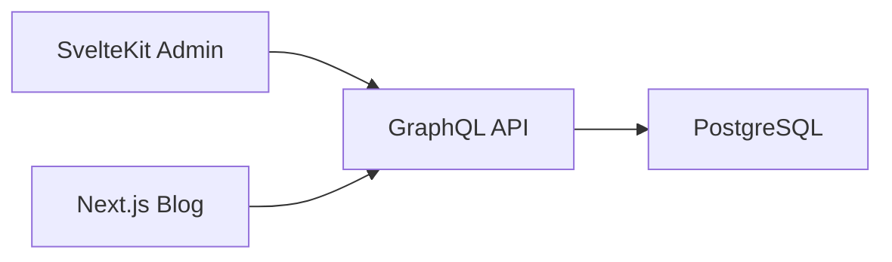

# White Flask

White Flask は pnpm workspace を使用したモノレポ構造による個人ブログサイトプロジェクトです。

## 🏗️ アーキテクチャ概要

### アプリケーション構成

- **📝 apps/blog** - 公開ブログサイト (Next.js 15 + React 19)
- **⚙️ apps/admin** - コンテンツ管理画面 (SvelteKit)
- **🚀 apps/backend** - GraphQL API サーバー (Pothos + GraphQL Yoga)

### ディレクトリ構造

```
white-flask/
├── apps/
│   ├── blog/           # Next.js ブログサイト
│   ├── admin/          # SvelteKit 管理画面
│   └── backend/        # GraphQL API
├── generated/          # 自動生成共有ファイル（Git 管理対象外）
├── scripts/            # セットアップスクリプト
├── package.json        # ワークスペース設定
├── pnpm-workspace.yaml # pnpm ワークスペース設定
└── docker-compose.yml  # PostgreSQL データベース
```

## 🛠️ 技術スタック

### フロントエンド (Blog)

- **Next.js 15.3.4** - React フレームワーク (App Router)
- **React 19.1.0** - UI ライブラリ
- **TypeScript 5.8.3** - 静的型付け
- **GraphQL** - データ取得 (GraphQL Request + SWR)
- **Feature-Sliced Design v2.1** - アーキテクチャパターン

### バックエンド (API)

- **Pothos** - 型安全な GraphQL スキーマビルダー
- **GraphQL Yoga** - 高速 GraphQL サーバー
- **Drizzle ORM** - TypeScript ORM
- **PostgreSQL** - リレーショナルデータベース

### 管理画面 (Admin)

- **SvelteKit** - フロントエンドフレームワーク
- **Vite** - ビルドツール
- **TypeScript** - 静的型付け

### 開発環境

- **pnpm** - パッケージマネージャー (workspace 対応)
- **Docker Compose** - PostgreSQL コンテナ管理
- **ESLint + Prettier** - コード品質・フォーマット
- **Lefthook + Commitlint** - Git フック・コミット規約

## 🎯 設計原則

### モノレポ設計

- **責務分離**: 各アプリケーションは独立した責務を持つ
- **共通化**: 型定義やスキーマは自動生成で共有
- **独立デプロイ**: 各アプリケーションは個別にデプロイ可能

### データフロー



### 型安全性

- **GraphQL Code Generator**: バックエンドスキーマからフロントエンド型定義を自動生成
- **Pothos**: コードファーストによる型安全な GraphQL スキーマ構築
- **Drizzle ORM**: TypeScript ネイティブなデータベース操作

## 🏛️ アーキテクチャパターン

### Blog (Feature-Sliced Design)

```
src/
├── app/           # Next.js App Router (ルーティング)
├── views/         # ページコンポジション
├── widgets/       # 独立した UI ブロック
├── features/      # ユーザー機能
├── entities/      # ビジネスエンティティ
├── shared/        # 共通コンポーネント・ユーティリティ
└── gql/           # GraphQL 自動生成ファイル
```

### Backend (レイヤード)

```
src/
├── server.ts      # GraphQL Yoga サーバー
├── schema.ts      # Pothos スキーマ定義
├── schema/        # データベーススキーマ
└── libs/          # ユーティリティ
```

### Admin (SvelteKit 標準)

```
src/
├── routes/        # ファイルベースルーティング
├── lib/           # 共通ロジック
└── app.html       # HTML テンプレート
```

## 🔄 開発フロー

### GraphQL 開発サイクル

1. **Backend**: Pothos でスキーマ定義・実装
2. **スキーマ生成**: `pnpm schema:generate` で SDL 出力
3. **型生成**: Blog で `pnpm codegen` 実行
4. **Frontend**: 型安全な GraphQL クライアント実装

### デプロイメント

- **Railway**: 各アプリケーション個別デプロイ (`railway.toml`)
- **Docker**: PostgreSQL はコンテナで運用
- **環境分離**: 開発・本番環境の完全分離

## 📖 ドキュメント

プロジェクト詳細は各アプリケーションのドキュメントを参照してください：

- **apps/blog/README.md** - Next.js ブログサイトの詳細
- **apps/backend/README.md** - GraphQL API の詳細
- **apps/admin/CLAUDE.md** - SvelteKit 管理画面の詳細
- **CLAUDE.md** - 開発ガイドライン・設計原則
